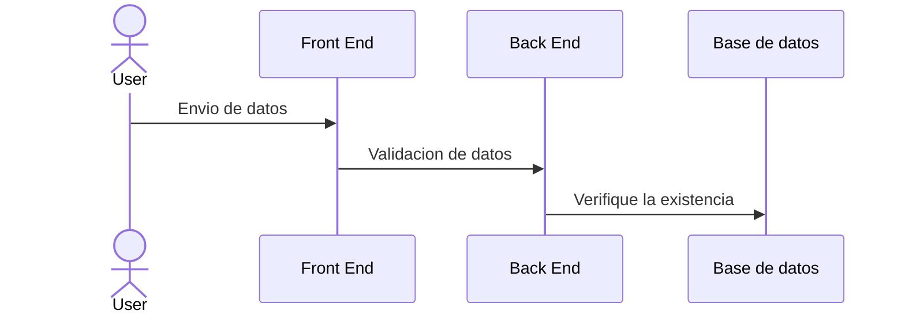

# Markdown Cheatsheet

## Tipos de encabezados

```
# H1 (Nivel 1)
```
- # Encebezado

```
## H2 (Nivel 2)
```
  - ## Encebezado
```
### H3 (Nivel 3)
```
- ### Encebezado
```
#### H4 (Nivel 4)
```
- #### Encebezado
```
##### H5 (Nivel 5)
```
- ##### Encebezado
```
###### H6 (Nivel 6)
```
- ##### Encebezado

## Tipos de listas

### 1. Listas ordenadas
1. Elemento
2. Elemento
3. Elemento

```
1. Elemento
2. Elemento
```
### 2. Listas desordenadas
- Elemento
- Elemento
  - Elemento

```
- Elemento
* Elemento
- Elemento
  - Elemento
```

## Enlaces
[Markdown](https://www.genbeta.com/guia-de-inicio/que-es-markdown-para-que-sirve-y-como-usarlo)

[Atom](https://la-respuesta.com/blog/que-es-atom-y-para-que-sirve/)

```
[Nombre o texto del enlace](URL del enlace)
```
## Imágenes


```

```

## Enfasis

### Cursiva
*Este texto esta en cursiva*

```
*Cursiva*
_Cursiva_
```

### Negrita
**Este texto esta en negrita**
```
**Negrita**
__Negrita__
```

### Cursiva y negrita

***Este texto esta en negrita y en cursiva***

```
***cursiva y negrita***
___cursiva y negrita___
```

## Citas
> Esto es una cita
>> Y esto es una cita dentro de otra cita

```
> cita
>> cita anidada
```

## Tablas

| Columna1 | Columna 2|
|----------|-----------|
| Valor    | Valor     |
| Valor    | Valor     |

```
| Columna1 | Columna 2|
|----------|-----------|
| Valor    | Valor     |
```

## Codigo
Para escribir codigo se utiliza el símbolo `, o se puede crear bloques con tres backticks.

### Bloque de codigo
``` java
public class Main{
  public static void main(String[] args){
    System.out.println("Hola Mundo");
  }
}
```

```
 ``` lenguaje
      Metodo, funcion o Clase
 ´´´
```

### Linea de codigo

`public static void main() {System.out.println("Hola mundo");}`

```
`Parte del codigo`
```

## Diagramas Especiales



## Comentarios
<!--Comentarios-->

```
<!--Comentarios-->
```
